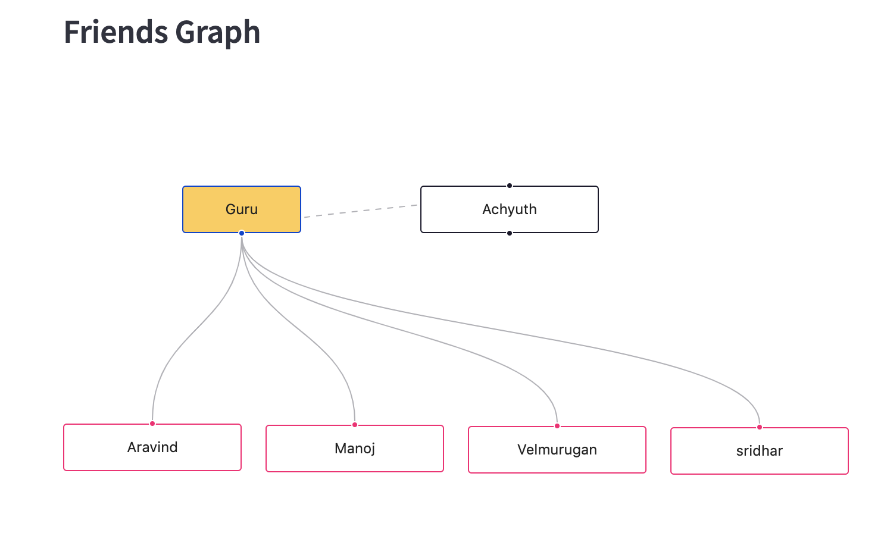

# streamlit-react-flow

A streamlit wrapper for easy-to-use flow graph library https://reactflow.dev/

### installation

```
pip install streamlit-react-flow
```

### example

```python
from streamlit_react_flow import react_flow
import streamlit as st

st.title("React-Flow Test")

st.subheader("Friends Graph")

elements = [
    { "id": '1', "data": { "label": 'Guru'  }, "type":"input","style": { "background": '#ffcc50', "width": 100 },
        "position": { "x": 100, "y": 100 } },
    { "id": '2', "data": { "label": 'Achyuth' },"position": { "x": 300, "y": 100 }},
    { "id": 'e1-2', "source": '1', "target": '2', "animated": True },
]

elements.extend([{"id":i+3,"data":{"label":name },"type":"output","position": { "x": 170*i, "y": 300+i }} for i,name in enumerate(["Aravind","Manoj","Velmurugan","sridhar"])])
elements.extend([{"id":f"e{i}-{j}","source":i,"target":j} for i,j in [(1,3),(1,4),(1,5),(1,6)]])
flowStyles = { "height": 500,"width":1100 }

# Create an instance of our component with a constant `name` arg, and
# print its output value.
react_flow("friends",elements=elements,flow_styles=flowStyles)

```

### The above example produces following graph


